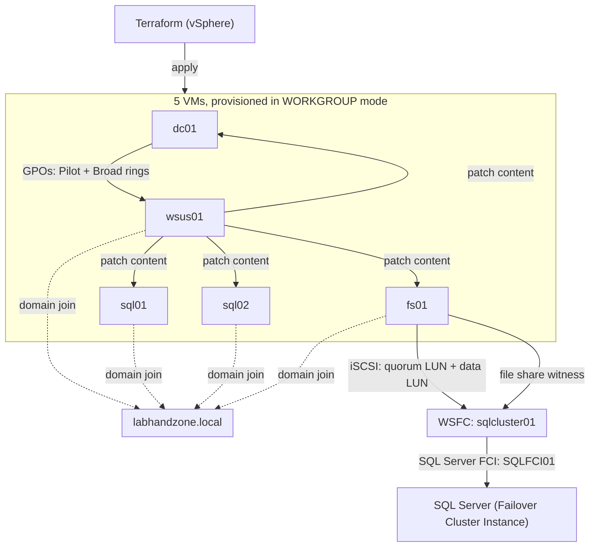

# labhandzone-infra


Infrastructure-as-code for a full lab Active Directory environment:
**Terraform** provisions 5 VMs on vSphere, **Ansible** then builds out a
real AD forest (`labhandzone.local`), a 2-node SQL Server Failover Cluster
Instance on iSCSI shared storage, a file server, a WSUS server, and a
GPO-driven ring-based patching process the same infrastructure shape a
lot of real mid-size environments still run today.

Companion to [windows-fleet-monitoring](https://github.com/blow-tech/windows-fleet-monitoring)
(which monitors a fleet like this one) and
[fleet-monitoring-stack](https://github.com/blow-tech/fleet-monitoring-stack) /
[linux-audit-toolkit](https://github.com/blow-tech/linux-audit-toolkit) on
the Linux side.

## Contents

- [Architecture](#architecture)
- [What gets built](#what-gets-built)
- [Prerequisites](#prerequisites)
- [Deployment sequence](#deployment-sequence)
- [Secrets](#secrets)
- [The patching process (what you actually asked for)](#the-patching-process-what-you-actually-asked-for)
- [Continuous integration](#continuous-integration)
- [Known limitations — read this before a real run](#known-limitations--read-this-before-a-real-run)
- [Roadmap](#roadmap)
- [License](#license)

## Architecture



## What gets built

| VM | Role | Notable detail |
|---|---|---|
| `dc01` | First DC of a new forest, `labhandzone.local` | Also DNS for the whole lab |
| `sql01` | SQL Server FCI node 1 (cluster creator) | 4 vCPU / 8GB RAM |
| `sql02` | SQL Server FCI node 2 | 4 vCPU / 8GB RAM |
| `fs01` | File server + iSCSI Target Server | 2 extra disks (5GB quorum, 100GB data) become iSCSI LUNs |
| `wsus01` | WSUS server | 150GB disk for patch content |

```
labhandzone-infra/
├── README.md
├── LICENSE
├── terraform/vsphere/          # 5 VMs — see terraform/vsphere/README.md
│   ├── main.tf, variables.tf, outputs.tf, versions.tf
│   ├── terraform.tfvars.example
│   └── modules/windows_vm/     # reusable VM-from-template module
└── ansible/
    ├── ansible.cfg, playbook.yml, requirements.yml
    ├── inventory/hosts.ini, group_vars/*.yml
    └── roles/
        ├── ad_domain_controller/   # Phase 1
        ├── domain_join/            # Phase 2
        ├── iscsi_target/           # Phase 3 (fs01)
        ├── file_server/            # Phase 3 (fs01) — witness + data shares
        ├── iscsi_initiator/        # Phase 4 (sql01/sql02)
        ├── windows_failover_cluster/  # Phase 5
        ├── sql_server_fci/         # Phase 6
        ├── wsus_server/            # Phase 7
        └── gpo_patching/           # Phase 8
```

## Prerequisites

- A vSphere environment with an existing Windows Server template (VMware
  Tools installed) Terraform clones from it, it doesn't build it. See
  [terraform/vsphere/README.md](terraform/vsphere/README.md).
- Ansible control node: `ansible-core` 2.15+, `pywinrm`, and the
  `ansible.windows` / `community.windows` / `microsoft.ad` collections
  (`ansible/requirements.yml`)
- **SQL Server installation media** licensed software this repo cannot
  provide. Mount it at `sql_server_media_path` on both SQL nodes before
  Phase 6.
- Every VM needs `windows-fleet-monitoring`'s WinRM bootstrap applied (or
  equivalent) before Ansible can reach it — Terraform's guest customization
  sets networking/hostname but does not enable WinRM. See that repo's
  `bootstrap/` for the GPO startup-script pattern; the same approach
  applies here.

## Deployment sequence

```bash
# 1. Provision the VMs
cd terraform/vsphere
cp terraform.tfvars.example terraform.tfvars   # fill in real values
terraform init && terraform apply

# 2. Enable WinRM on each VM (GPO startup script, or manually for a lab —
#    see windows-fleet-monitoring/bootstrap/)

# 3. Build out the domain, storage, cluster, SQL, WSUS, and GPOs
cd ../../ansible
pip install pywinrm
ansible-galaxy collection install -r requirements.yml
cp inventory/hosts.ini inventory/hosts.ini.local   # fill in real hostnames/IPs

# Mount SQL Server media on sql01 and sql02 at D:\SQLServerSetup before
# this next command reaches Phase 6.

ansible-playbook -i inventory/hosts.ini.local playbook.yml --check --diff   # dry run
ansible-playbook -i inventory/hosts.ini.local playbook.yml
```

The playbook is one file with 8 ordered plays (Phase 1 through 8 — see
`ansible/playbook.yml`). Don't `--limit` to a later phase on a completely
fresh environment; each phase depends on the state the previous one left
behind (the domain has to exist before anything can join it, storage has
to be attached before the cluster can claim it, etc.).

## Secrets

Every `CHANGE_ME_VIA_ANSIBLE_VAULT` placeholder across `group_vars/*.yml`
needs a real value before a real run:

```bash
ansible-vault encrypt_string 'RealPassword123!' --name 'vault_local_admin_password'
```

That covers: the shared local Administrator password (set by Terraform's
guest customization, reused by Ansible throughout — see the comment in
`inventory/hosts.ini` on why), the AD Safe Mode password, and the SQL
Server service account passwords. Never commit real values everything
sensitive in this repo is a placeholder by design.

## The patching process (what you actually asked for)

`gpo_patching` implements a two-ring model, the same shape most real
patch-management processes use:

1. **Pilot ring** a small set of machines (put your less-critical or
   canary servers' computer objects in `OU=Pilot,OU=PatchRings,...`)
   installs approved updates within 1 day, with WSUS detection checking in
   every 6 hours. This is where you find out an update breaks something,
   before it reaches anything that matters.
2. **Broad ring** — everything else, in `OU=Broad,OU=PatchRings,...`,
   installs the same updates a week later, once Pilot has proven them safe.

Both rings get their own GPO with WSUS client-targeting registry values
(`WUServer`, `TargetGroup`, `ScheduledInstallDay/Time`) move a computer
object into the right OU, and Group Policy handles the rest on its next
refresh. Approvals themselves still happen in the WSUS console (or via the
WSUS PowerShell module) GPOs control *when a machine checks for and
installs* approved updates, not *which updates get approved*; that
separation is deliberate and matches how WSUS actually works.

## Continuous integration

Every push/PR runs via GitHub Actions (`.github/workflows/ci.yml`):
- `yamllint` across `ansible/`
- `ansible-playbook --syntax-check` + `ansible-lint` (non-blocking — same
  `var-naming[no-role-prefix]` style findings as the sibling repos, not
  hidden, just not yet fixed)
- **`terraform fmt -check` + `terraform validate`** this was written
  without a local `terraform` binary (sandboxed dev environment, no route
  to HashiCorp's release servers), so this CI job is the actual first
  verification these `.tf` files get
- **PowerShell template syntax check** the two `.ps1.j2` templates
  (`gpo_patching`, `wsus_server`) are rendered with real Jinja2 and
  representative dummy data, then parsed by the genuine PowerShell parser
  on a `windows-latest` runner. This replaced an earlier, weaker approach
  (regex-stripping Jinja tags) after testing showed it produced ambiguous,
  falsely-failing PowerShell for the loop-based template endering with
  the real templating engine first is the correct fix, not a workaround.

## Known limitations read this before a real run

Being direct about what has and hasn't actually been verified, same as
the sibling repos:

- **Nothing here has run against a real vCenter or real Windows Server
  VMs end-to-end.** Every piece is syntax/schema/structurally validated
  (see Continuous integration above) and hand-reviewed carefully — several
  real bugs were caught and fixed this way during development (an invalid
  `vsphere_virtual_machine.tags` usage, a broken disk `unit_number`
  calculation, a wrong assumption in `iscsi_initiator` about disks
  arriving pre-formatted, a YAML-breaking typo in `sql_server_fci`) but
  syntax-valid is not the same as "this cluster will actually form."
  Budget real troubleshooting time for the first live run, especially
  around WSFC quorum/networking and SQL FCI setup.
- **SQL Server FCI setup is the least-verified piece.** The
  `ConfigurationFile.ini` parameter set is accurate as of SQL Server
  2019/2022 from Microsoft's documented reference, but exact requirements
  shift slightly by version/edition/patch level — cross-check against
  Microsoft's current docs before a real run, and check
  `C:\Program Files\Microsoft SQL Server\<version>\Setup Bootstrap\Log\`
  on the target if `setup.exe` fails; Ansible's own error output won't
  explain a SQL setup failure in useful detail.
- **Single DC, single forest, lab-appropriate simplifications throughout**
  — no second DC for redundancy, the witness share is permissioned to
  `Domain Computers` rather than the cluster's specific computer account
  (documented reasoning in `file_server`'s tasks), WSUS uses the Windows
  Internal Database rather than a real SQL back end. All reasonable for a
  lab; all worth hardening before treating this as a production pattern.
- **Terraform's guest customization sets networking, not WinRM.** You
  still need the bootstrap step from `windows-fleet-monitoring` (or
  equivalent) before Ansible can reach any of these VMs.

## Roadmap

- [ ] Actually run this against a real vSphere lab end-to-end and fix
      whatever the first real run inevitably surfaces
- [ ] Second DC for redundancy, rather than a single point of failure
- [ ] Harden the witness share permission to the cluster's specific
      computer account instead of `Domain Computers`, as a post-cluster-
      creation follow-up task
- [ ] Point WSUS at a real SQL back end instead of WID
- [ ] Packer template to build the Windows Server VM template Terraform
      clones from, so the whole chain — template build through GPO
      patching — is code, not a manual first step
- [ ] Always On Availability Group as an alternative to FCI in a separate
      `ansible/roles/sql_server_ag/`, for environments without shared
      storage

## License

MIT — see [LICENSE](LICENSE).
